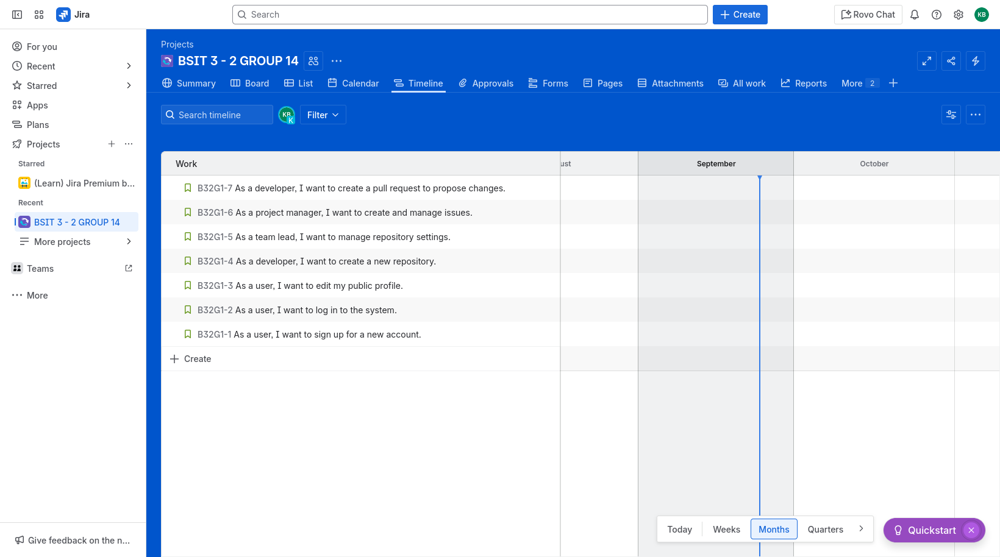

# Activity 2: Requirements Analysis

## Group 14:
 

### members:

Aljohn Wahid

Karl Benjamin R. Bughaw

Suzanne Habitan

John Lennon Sanchez

[INTE301_IT3-2_Act2_Grp14 Jira link](https://foredu.atlassian.net/jira/core/projects/B32G1/timeline?atlOrigin=eyJpIjoiNDcyMWM0OGVjM2YzNGU0YjkwYzNlNTI0YzdlMmZjMzAiLCJwIjoiaiJ9)

